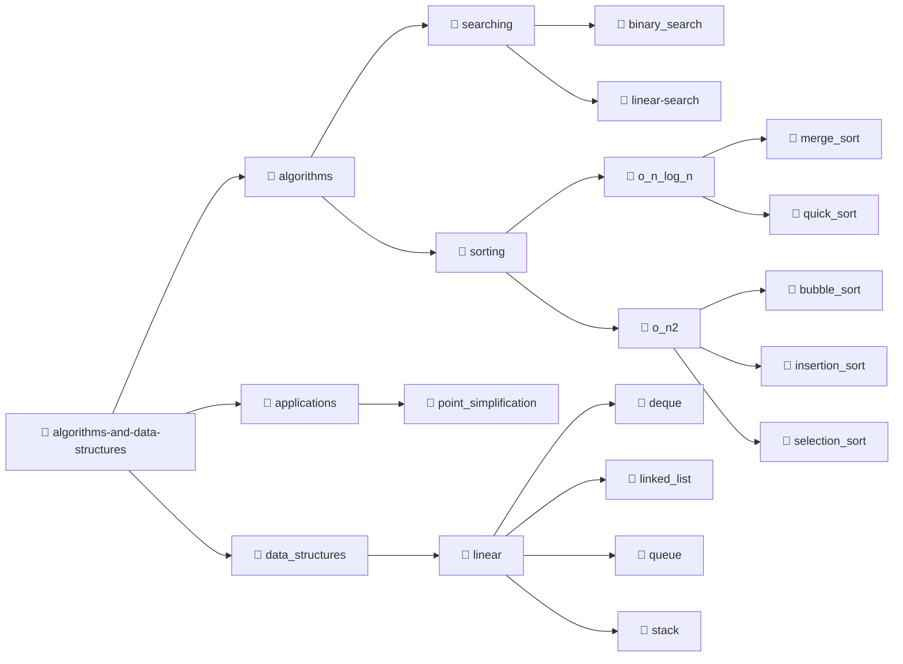

# 💻 Algoritmos e Estruturas de Dados

## 🎯 O Desafio
Construir uma base teórica sólida em Ciência da Computação implementando as principais estruturas de dados e algoritmos de ordenação e busca na linguagem C. O maior desafio é, além de entender a matemática por trás de cada método, garantir que não há acessos indevidos de memória e nem vazamentos. Além disso, meu objetivo é pensar algoritmicamente para escolher os melhores tipos abstrados de dados para cada exercícios de aplicação.

## 📄 Descrição
Este repositório serve como uma biblioteca pessoal de estudos. Ele consolida algoritmos clássicos e tipos abstratos de dados (TADs), além de trazer aplicações práticas que unem múltiplas estruturas.

A biblioteca está estruturada nos seguintes pilares:
1. **Algoritmos:** Métodos de busca e ordenação implementados de forma iterativa e/ou recursiva, sub-divididos pela sua complexidade de tempo (Notação Big-O);
2. **Estruturas de Dados:** Tipos lineares, como lista encadeada, pilha, fila e deque;
3. **Aplicações Práticas:** Códigos que utilizam múltiplos TADs interligados para resolução de alguma aplicação;

## 🗂️ Estrutura do Repositório
Os códigos estão sub-divididos em pastas para melhor organização. Todos estão modularizados, ou seja, possuem arquivos `.c` e `.h` e alguns possuem `main.c`que pode ser executado para averiguar o seu funcionamento.Seguem a seguinte disposição:



## 📥 Instruções de Instalação e Uso
### ❗ Pré-requisitos
* Sistema operacional Linux
* Compilador C (`gcc`)

Caso não tenha o compilador instalado:
```bash
sudo apt update
sudo apt install gcc
```

## 💻 Como usar
Para testar qualquer implementação, navegue até a respectiva pasta e compile o arquivo `main.c` junto com a biblioteca:

```bash
gcc main.c nome_do_arquivo.c -o main
```
Em seguida execute:
```bash
./teste
```

### Otimizador de Pontos
Esse algoritmo possui um `makefile`, você pode rodar apenas digitando
```bash
make
```
Em seguida execute:

```bash
./programa <flag> <margem de tolerância>
```
Onde:
* `flag` 
    * <kbd>-a</kbd> para cálculo da área do triângulo formado por 3 pontos consecutivos
    * <kbd>-h</kbd> para cálculo da altura do triângulo formado por 3 pontos consecutivos
* `margem de tolerância` - valor em float do erro mínimo permitido

## 📈 Resultados e Aprendizados
* **Gerenciamento de Memória em C:** Aprendi sobre o controle de ponteiros, structs e alocação dinâmica, assim como uso do `valgrind` para verificar vazamento de memória
* **Análise de Complexidade (Big-O):** Compreensão matemática de como a escolha estrutural entre um algoritmo $O(n^2)$ e um $O(n \log n)$ impacta no tempo de execução em larga escala
* **Integração de Múltiplos TADs:** No otimizador de pontos, aprendi a pensar computacionalmente como resolver um exercício de aplicação, interconectar duas estruturas de dados diferentes e cuidar com o custo de processamento para não ultrapassar $O(n \log n)$